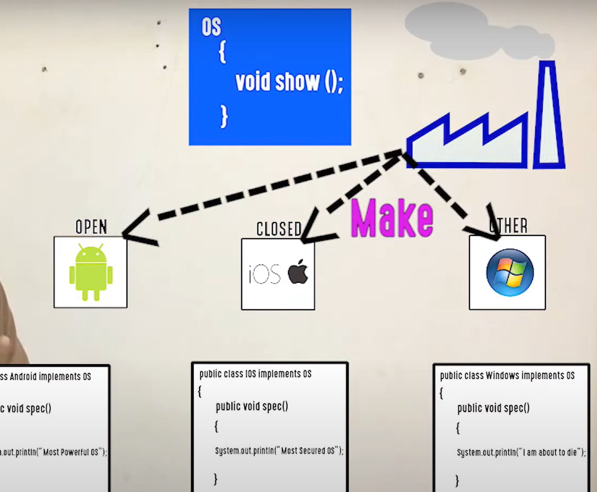
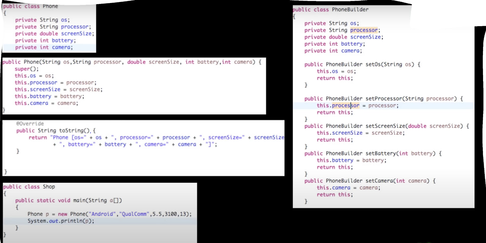
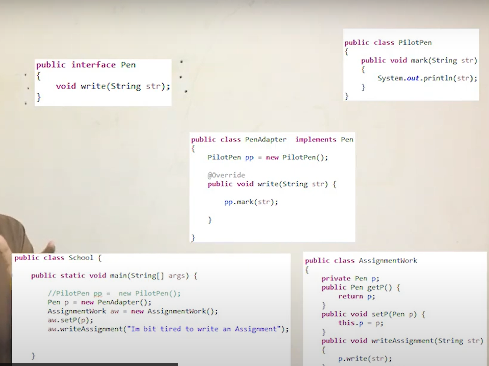
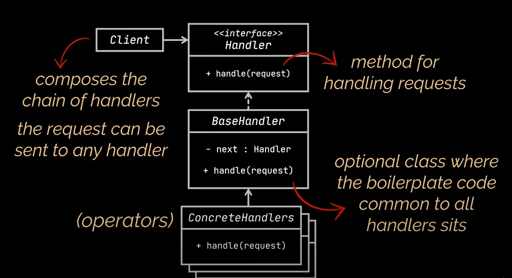
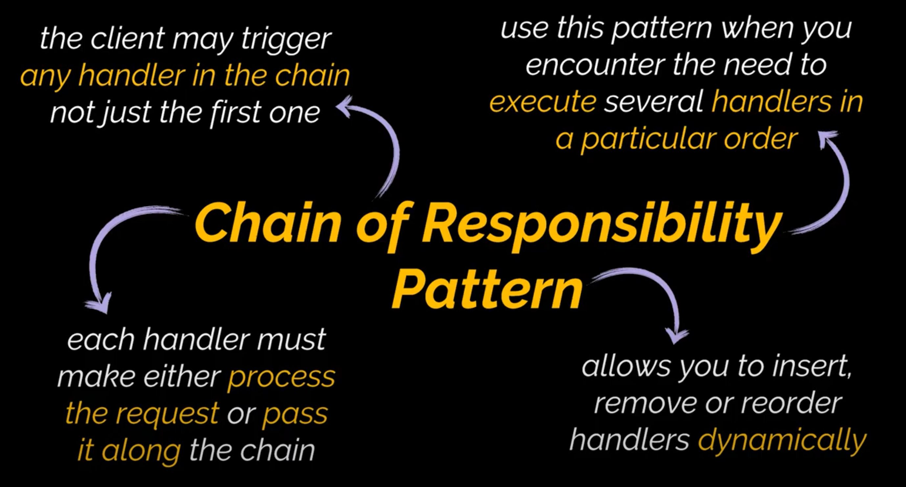
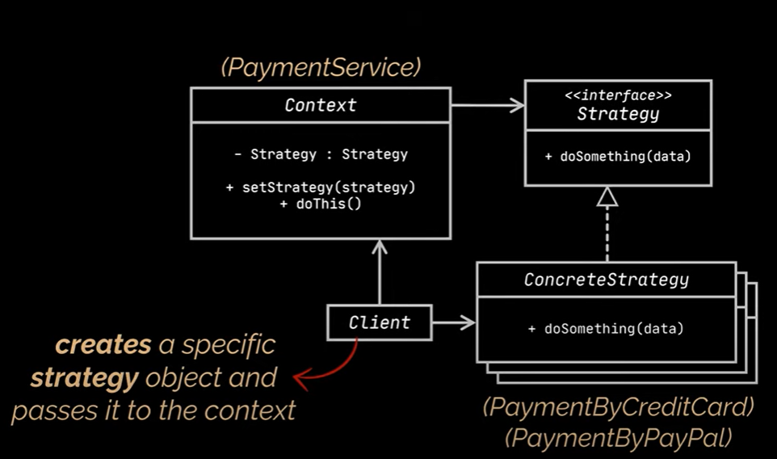
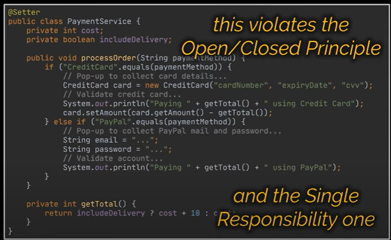

Design Patterns 
===

There are 3 types of patterns.

1- CREATIONAL DESIGN PATTERN:

 If our requirement needs to create object or get the object we need to use Creational pattern.

2-  STRUCTURAL DESING PATTERN: 

If I need to compose object, if I have several objects and one need to use other's feature in this case we need to
consider structural design patterns

3- BEHAVOURAL DESIGN PATTERN:

If we don't want to compose them but we want to communicate between them 
in this case we need to consider using Behavoural pattern

1. Creational Pattern
 1.1 Factory Design Pattern

Factory will decide to give the object 

  We have an interface and multiple implementations.

 1.2 Builder Design Pattern
 How can we set objects fields. We can use setter, we can set with constructor
 In constructor we should pass maybe all value or we should consider sequence of parameters
 (order of them).
 

2. Structural Design Pattern
 2.1 Adapter Design Pattern
 
From another Interface or other class we adapt our need from it. 

3. Behavoural Design patterns

 3.1 Observer Design pattern
 Assume YouTube channel tastekine, and it has subscribers each of them observer
 they subscribe your channel, and you inform every time you upload a video
 
 3.2 Chain of Responsibilities

 
 Each handler responsible only single task
 

The request doesn't have to start from first handler 

3.2 Strategy Design Pattern

We need to place each payment method in its own class making this class
responsible for a particular payment strategy.

Strategy D. Pattern defines a family of algorithms, puts each of them in a
separate class, and makes their objects interchangeable.